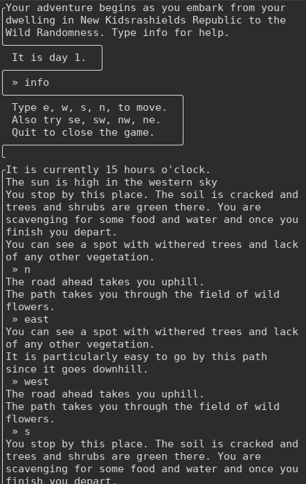

# Text based game narrative ui mockup
## Just launch "START.py" with python3, or if you are on Termx, you can try the Text-to-speech wrapper, which requires Termux-API add-on.

Demo video: https://youtu.be/xZzNH2DxGPo

Demo video (using voice input and text to speech): https://youtu.be/_jgzAddgEPU

